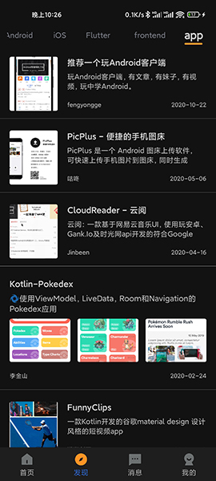

# BaseApp 

#### MVVM+Kotlin+Jetpack+组件化的一套快速开发框架，解决以下开发痛点，提高开发效率，拒绝重复搬砖：

* 1.开一个新项目、做一个以前实现过的功能，需要再打开以前项目的代码，抽取出来。
* 2.工具类杂乱无章，用到什么再去找。
* 3.项目耦合度高，可复用性低。没有分模块，没有一个好用、全面的Base模块。
* 4.演示模块lib_main使用干货集中营提供的API，整理过往常见需求和某些功能点，也是一个复习和检查自我的过程。

* 注1.2021.11.24 干货集中营API已不可访问，将寻求其它API代替。
* 注2.2022.1.16 已替换多数API为Wanandroid提供的API。
* 注3.2023.8.4 移除阿里路由，使用Navigation单Activity多Fragment模式。

#### 能为项目带来：
* 1.新项目快速开发，已集成配置好ARouter、DataBinding、网络请求等框架，上手即用。
* 2.组件化开发，模块间使用路由跳转，资源、引用框架等统一管理。
* 3.MVVM架构，解耦更加彻底。在mvvm模式中，View和Model使用databingding进行双向绑定，一方改变会直接通知另外一方，使得viewmodel能专注于业务逻辑的处理，而不需要去关心ui刷新。
* 4.封装常用工具类：Glide图片加载、刘海屏区域高度、弹窗、软键盘工具类等。
* 5.开发中常见功能实现：刷新、加载更多、RecyclerView多布局、轮播图、扫码、TabLayout、瀑布流、验证码等。
* 6.自定义View思路和基本实现。
* 7.各种嵌套带来的滑动冲突解决思路和基本实现。
* 8.夜间模式、Material Design沉浸式。

#### 使用到的框架：

* 1.JetpackMvvm（MVVM开发框架） : https://github.com/hegaojian/JetpackMvvm
* 2.AndroidUtilCode（工具类集合） : https://github.com/Blankj/AndroidUtilCode
* 3.Net（协程网络请求库） : https://github.com/liangjingkanji/Net
* 4.XPopup（弹窗Dialog） : https://github.com/li-xiaojun/XPopup
* 5.MMKV（键值对存储，替代SP） : https://github.com/Tencent/MMKV

#### APP下载体验：[蒲公英](https://www.pgyer.com/2qC1)。扫码下载：
 

#### UI展示

  

  

